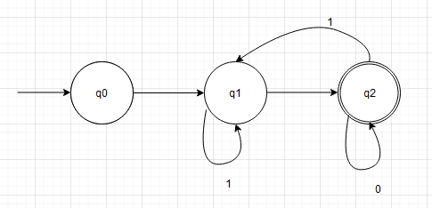
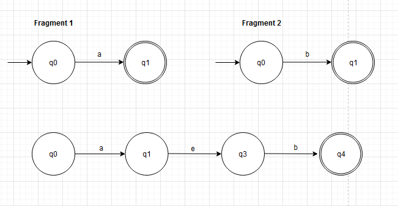
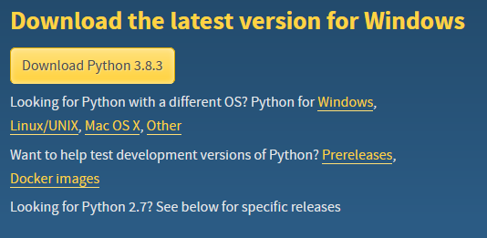
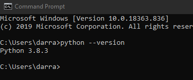

## Introduction
Welcome to my overview.md, my name is Darragh and I want to pitch the idea of this project to you, the reader. The main goal for this document is to act as a guide for students entering the 3rd year Software Development module 'Graph Theory'. This project was developed by Dr. Ian McLoughlin for our 2020 class. We are to create a python program that takes two inputs,

* Regular Expression - eg a.b
* String to be tested - ab

By passing both the above via console the program will execute, giving back a True or False depending if the string is excepted in the language of the regular expression. The program creates an Non-Deterministic Finite Automata aka NFA, we must take a step back and cover first the Deterministic Finite Automata aka DFA.

### Regular Expression
A regular expression aka regex, is a method of pattern matching used in programming. It is a sequence of characters that define a search pattern. They are implemented in most find and find \& replace operations on a string. The below table has some examples.

Regex Operator | Example | Defined 
---------- | ---------- | ----------
 . | a.b | character *a* followed by *b*
 \| | a\|b | character *a* or character *b*
 \* | a\* | Any number of character *a* including zero
 \+ | a\+ | One or more of the character *a*
 \? | a\? | Zero or one of the character *a*

### Deterministic Finite Automata
A DFA is a 'finite state machine' that either accepts or rejects a given String (series of character) by passing it through a set of 'states'. Deterministic means that it can be in only one state at a time. A DFA is made up of 5 tuples.
M = \{Q, &epsilon;, &delta;, q0, F}

Symbol | Meaning
---------- | ----------
 Q | The set of states
 &epsilon; | Alphabet
 &delta; | Transition Function
 q0 | Start State
 F | Final State

Below is an example of a DFA with &epsilon;\{0,1\} which accepts strings that start in a *1* and end in an *0*

### Non Deterministic Finite Automata
Non Deterministic on the other hand can by in multiple states at the same time. It can also use empty string transition. It is made up of multiple smaller machines.
* Only needs to know &delta;, q0 and F
* Nothing points *to* q0
* Nothing points *from* F
* Every state has a single symbol arrow *or* 1-2 e arrows
The below is an example of an NFA that is constructed with the regex a.b, meaning it will accept an *a* followed by a *b*. It is made up of two fragments.

## Run
There are a number of steps involved to run this program.
1. Download and install Python.
2. Clone/Download my repository.
3. Execute program.

Each of these steps have a number of sub steps involved. Start with installing Python.
### Installing Python
* Using your browser navigate to 'https://www.python.org/downloads/'.
* Select 'Download Python (current version number)' this will begin downloading the installer.

* Save file to your machine.
* Open file and follow the instructions.
* To check that it has in fact downloaded;
	* Click on Windows button.
	* Type CMD.
	* When the command window opens type 'python --version'.
	* You should see a message with Python and its version number.

### Clone Repository

* Using your browser navigate to 'https://github.com/DarraghLally/Graph_Theory_Project'.
* Select the Clone/Download button.
* Download zip to machine.
* Unzip file.

### Execute
* Open the file in CMD.
* Type: 'python regex.py'
* Option 1 - Manual Entry
	* You will be asked to input a regular expression, eg - a.b (a followed by a b).
	* You will be asked to input a string to be tested, eg - a. 
	* Program will output a True or False answer indicating that the string has or has not been accepted.
* Option 2 - Run automated tests
	* Will run hardcoded tests and output is succesful or not. Tests cover each operator and combinations of operators.
* Option 3 - Help menu, I tried to implement argsparse after the fact but I could not debug the issues I was encountering. The code is left in regex.py, commented out.
* Option 4 - Teminate execution.

## Testing

## Algorithm

## References
I found plenty of useful information both online and through Ians video series on the project. I have broken the resources up into catogories in which they were used.

### Youtube Videos
https://www.youtube.com/user/Computerphile/videos?view=0&sort=dd&shelf_id=1

### Working with \+ and \?
https://chortle.ccsu.edu/FiniteAutomata/Section07/sect07_19.html
https://javascript.info/regexp-quantifiers
https://www.vogella.com/tutorials/JavaRegularExpressions/article.html

### Operator Precedence
https://www.boost.org/doc/libs/1_56_0/libs/regex/doc/html/boost_regex/syntax/basic_extended.html#boost_regex.syntax.basic_extended.operator_precedence
https://www.gnu.org/software/gcal/manual/html_node/Regexp-Operators.html

### PEP Docs
https://www.python.org/
Note: I added my own 'style' between classes and functions. The documentation suggests 2 and 3 line spaces but I find it easier to read when there is a clear break between blocks. I do hope this is acceptable!

### Python Tutorials
Note: Used for example to find out the correct function for console input, with my version of python I must use raw_input\(\).
https://realpython.com/
https://www.geeksforgeeks.org/

### Regular Expressions
https://www.tldp.org/LDP/Bash-Beginners-Guide/html/sect_04_01.html
https://www.vogella.com/tutorials/JavaRegularExpressions/article.html
https://regexr.com/
https://swtch.com/~rsc/regexp/regexp1.html

### Mark Down Language
https://waher.se/Markdown.md#specialCharactersInHtml/
https://guides.github.com/features/mastering-markdown/

### Working with VIM
https://www.howtoforge.com/vim-basics

