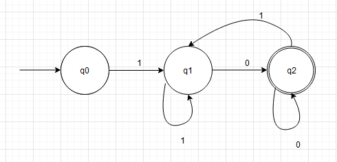

## Introduction
Welcome to my overview.md, my name is Darragh and I want to pitch the idea of this project to you, the reader. The main goal for this document is to act as a guide for students entering the 3rd year Software Development module 'Graph Theory'. This project was developed by Dr. Ian McLoughlin for our 2020 class. We are to create a python program that takes two inputs,

* Regular Expression - eg a.b
* String to be tested - ab

By passing both the above via console the program will execute, giving back a True or False depending if the string is excepted in the language of the regular expression. The program creates an Non-Deterministic Finite Automata aka NFA, we must take a step back and cover first the Deterministic Finite Automata aka DFA.

### Regular Expression
A regular expression aka regex, is a method of pattern matching used in programming. It is a sequence of characters that define a search pattern. They are implemented in most find and find \& replace operations on a string. The below table has some examples.

Regex Operator | Example | Defined 
---------- | ---------- | ----------
 . | a.b | character *a* followed by *b*
 \| | a\|b | character *a* or character *b*
 \* | a\* | Any number of character *a* including zero
 \+ | a\+ | One or more of the character *a*
 \? | a\? | Zero or one of the character *a*

### Deterministic Finite Automata
A DFA is a 'finite state machine' that either accepts or rejects a given String (series of character) by passing it through a set of 'states'. Deterministic means that it can be in only one state at a time. A DFA is made up of 5 tuples.
M = \{Q, &epsilon;, &delta;, q0, F}

Symbol | Meaning
---------- | ----------
 Q | The set of states
 &epsilon; | Alphabet
 &delta; | Transition Function
 q0 | Start State
 F | Final State

Below is an example of a DFA with &epsilon;\{0,1\} which accepts strings that start in a *1* and end in an *0*


### Non Deterministic Finite Automata
Non Deterministic on the other hand can by in multiple states at the same time. It can also use empty string transition. It is made up of multiple smaller machines.
* Only needs to know &delta;, q0 and F
* Nothing points *to* q0
* Nothing points *from* F
* Every state has a single symbol arrow *or* 1-2 e arrows
The below is an example of an NFA that is constructed with the regex a.b, meaning it will accept an *a* followed by a *b*. It is made up of two fragments.


## Run
There are a number of steps involved to run this program.
1. Download and install Python.
2. Clone/Download my repository.
3. Execute program.

Each of these steps have a number of sub steps involved. Start with installing Python.
### Installing Python
* Using your browser navigate to 'https://www.python.org/downloads/'.
* Select 'Download Python (current version number)' this will begin downloading the installer.

* Save file to your machine.
* Open file and follow the instructions.
* To check that it has in fact downloaded;
	* Click on Windows button.
	* Type CMD.
	* When the command window opens type 'python --version'.
	* You should see a message with Python and its version number.


### Clone Repository

* Using your browser navigate to 'https://github.com/DarraghLally/Graph_Theory_Project'.
* Select the Clone/Download button.
* Download zip to machine.
* Unzip file.

### Execute
* Open the file in CMD.
* Type: 'python regex.py'
* Option 1 - Manual Entry
	* You will be asked to input a regular expression, eg - a.b (a followed by a b).
	* You will be asked to input a string to be tested, eg - a. 
	* Program will output a True or False answer indicating that the string has or has not been accepted.
* Option 2 - Run automated tests
	* Will run hardcoded tests and output is succesful or not. Tests cover each operator and combinations of operators.
* Option 3 - Help menu, I tried to implement argsparse after the fact but I could not debug the issues I was encountering. The code is left in regex.py, commented out.
* Option 4 - Teminate execution.

## Testing
To test my program i used the library unittest. unittest takes its insperation from Java's JUnit library. I wrote a class AutoTesting, which has a method to test each operator, in each method my function match is called, passing in two arguments
* Regular Expression
* String
Here is an example of one of the methods,

```python

def test_and_or(self):
        self.assertTrue(match("a.b|b*", "bbbbb"))
        self.assertFalse(match("a.b|b*", "bbbbbn"))
```


These tests are run when the user chooses option 2 in the main menu. I also have included tests which will run if the module is imported into another module - 
```python
if __name__ == "__main__":
    # An array of tests
    tests = [
        ["a.b|b*", "bbbbb", True],
        ["a.b|b*", "bbbbbx", False],
        
        ["a.b", "ab", True], 
        ["a.b", "c", False], 
        
        ["b*", "", True],
        ["b**", "bbbbbbx", False],

        ["b+", "bbb", True],
        ["b+", "", False],

        ["c?", "", True],
        ["c?", "aa", False],

        ["c|a", "c", True],
        ["c|a", "b", False]

    ]
    # Loop through and print result.
    for test in tests:
        assert match(test[0], test[1]) == test[2], test[0] + " should match " if test[2] else " should not match " + test[1]

```

## Algorithm
To achieve the goal of creating and NFA from a regular expression we needed to create a program with a number of algorithms. When correctly constructed the process will take in both a regular expression and string. It will create the NFA from the regular expression and test the string through the final machine. There are a number of steps to be taken for us to construct an NFA.
* Create a fragment with a start and accept state. 
```python
class Fragment:
    """An NFA fragment, with a start and accept state"""
    # Constructor
    def __init__(self, start, accept):
        # Start state of NFA
        self.start = start  
        # Accept state of NFA
        self.accept = accept
```
* Create a state.
```python
class State:
    """A State with labelled edges"""
    # Constructor
    def __init__(self, label=None, edges=None):
        # Each state has 0-2 edges
        self.edges = edges if edges else []
        # Each edge is labelled
        self.label = label
```
* Create a function to convert infix notation to postfix notation
	* This is done with the Shunting Yard aglorithm.
	* Example of infix - a.b
	* Example of postfix - ab.
The Shunting Yard Algorithm is a technique for parsing infix expressions into its postfix equiviant, taking into account operator precedence. I have inplemented it using the stack data structure.
```python
def shunt(infix):
    """shunt
    Shunting Yard Algorithm to parse and return regex in postfix notation 
    """
    # Convert input to a stack, in reverse order
    infix = list(infix)[::-1]
    # Operator Stack
    opers = []
    # Postfix regex
    postfix = []
    # Operator presidence 
    prec = {'*':100, '+':100, '?':100, '.':70, '|':60, ')':40, '(':40 }

    while infix:
        # Pop a char from the input
        c = infix.pop() # Returns and removes last element
        if c == '(':
            # If its an open bracket push to opers stack
            opers.append(c)
        elif c == ')':
            # Pop the operators stack until you find an open bracket
            while opers[-1] != '(':
                postfix.append(opers.pop())
            # Get rid of the open bracket
            opers.pop()
        # Decide what to do based on the char
        elif c in prec:
            # Push operators on the opers stack with higher pref to output
            while opers and prec[c] < prec[opers[-1]]:
                postfix.append(opers.pop())
            # Push c to opers stack
            opers.append(c)
        else:
            # Typically, we just push the char to the output
            postfix.append(c)

    while opers:
        # Pop all operators to the output
        postfix.append(opers.pop())

    # Convert output list to string
    return ''.join(postfix)
```
* The function *match* takes in the regex and string from the command line. This function does all the heavy lifting ie it calls the relevent functions in order, finally returning True is the string has been accepted.
```python
def match(regex, s):
    """match
    A function that returns True if regular expression
    (regex) matchs the string (s)
    """
    # Compile regex into NFA
    nfa = compile(regex)
    # Current set of states
    current = set()
    # Add first state, and follow all 'e' arrows
    followepsilon(nfa.start, current)
    # Previous set of states
    previous = set()

    for c in s: 
        # Keep track of where we were
        previous = current
        # Create a new empty set for states we will soon be in
        current = set()

        for state in previous:
            # Only follow arrows not labelled by E, epsilon
            if state.label is not None:
                # If label of the state is == to char
                if state.label == c:
                    # Add state at the end of the edge to current
                    followepsilon(state.edges[0], current)
    
    # Only one accept state, if we are there, return true!
    return nfa.accept in current
``` 

## References
I found plenty of useful information both online and through Ians video series on the project. I have broken the resources up into catogories in which they were used.

### Youtube Videos
https://www.youtube.com/user/Computerphile
https://www.youtube.com/user/Computerphile/videos?view=0&sort=dd&shelf_id=1

### Working with \+ and \?
https://chortle.ccsu.edu/FiniteAutomata/Section07/sect07_19.html
https://javascript.info/regexp-quantifiers
https://www.vogella.com/tutorials/JavaRegularExpressions/article.html

### Operator Precedence
https://www.boost.org/doc/libs/1_56_0/libs/regex/doc/html/boost_regex/syntax/basic_extended.html#boost_regex.syntax.basic_extended.operator_precedence
https://www.gnu.org/software/gcal/manual/html_node/Regexp-Operators.html

### PEP Docs
https://www.python.org/
Note: I added my own 'style' between classes and functions. The documentation suggests 2 and 3 line spaces but I find it easier to read when there is a clear break between blocks. I do hope this is acceptable!

### Python download
https://www.python.org/downloads/

### Python Tutorials
Note: Used for example to find out the correct function for console input, with my version of python I must use raw_input\(\).
* https://realpython.com/
* https://www.geeksforgeeks.org/

### Regular Expressions
* https://www.tldp.org/LDP/Bash-Beginners-Guide/html/sect_04_01.html
* https://www.vogella.com/tutorials/JavaRegularExpressions/article.html
* https://regexr.com/
* https://swtch.com/~rsc/regexp/regexp1.html
* https://en.wikipedia.org/wiki/Regular_expression

### Finite Automata
* https://math.stackexchange.com/questions/563829/difference-between-nfa-and-dfa
* https://www.geeksforgeeks.org/difference-between-dfa-and-nfa/
* https://www.javatpoint.com/examples-of-deterministic-finite-automata

### Shunting Yard
* https://brilliant.org/wiki/shunting-yard-algorithm/

### Mark Down Language
* https://waher.se/Markdown.md#specialCharactersInHtml/
* https://guides.github.com/features/mastering-markdown/
* https://en.wikipedia.org/wiki/List_of_XML_and_HTML_character_entity_references
* https://www.keynotesupport.com/internet/special-characters-greek-letters-symbols.shtml

### Working with VIM
* https://www.howtoforge.com/vim-basics

### Command Line Arguments
* https://docs.python.org/3.3/library/argparse.html
* https://pymotw.com/2/argparse/

### Unit Testing
* https://docs.python.org/3/library/unittest.html
